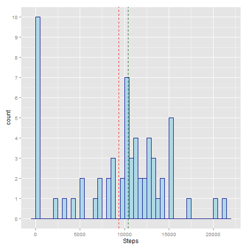
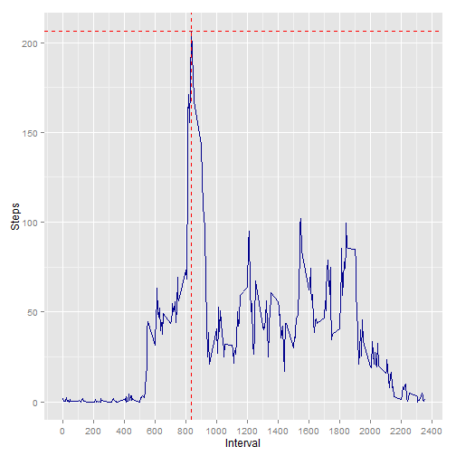
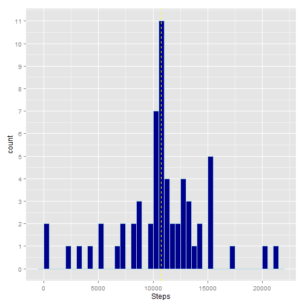
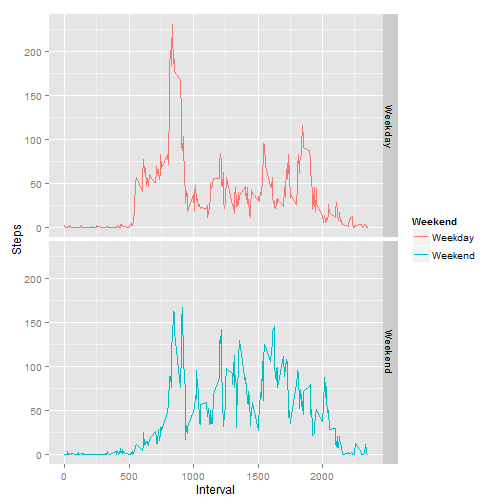

###Loading and Preprocessing the Data###
We begin by reading in the file. I am assuming that the RepData_PeerAssessment1 repository has been forked and cloned from Roger Peng, and that we have the zipped directory "activity.zip" in the working directory.

```r
unzip("activity.zip")
activity<-read.csv("activity.csv")
```
This loads our data into a variable named activity. The first several rows of the data look like this:

```r
head(activity)
```

```
##   steps       date interval
## 1    NA 2012-10-01        0
## 2    NA 2012-10-01        5
## 3    NA 2012-10-01       10
## 4    NA 2012-10-01       15
## 5    NA 2012-10-01       20
## 6    NA 2012-10-01       25
```
I know that I will later want to use the date as a POSIXct date , so I will check to see what class that column is now, and change it if necessary.

```r
class(activity$date)
```

```
## [1] "factor"
```
Since it is not in the format that I want, I will coerce to the class I want.

```r
activity$date<-as.POSIXct(activity$date)
```
I also want to create a column for the day of the week, and whether or not a day is during the weekend, because I know that I'll have to use that information a little later on. I am going to use dplyr to do this.

```r
library(dplyr)
activity<-mutate(activity, day = as.factor(weekdays(date)))
activity<-mutate(activity, weekend = as.factor(activity$day%in%c("Saturday","Sunday")))
levels(activity$weekend)<-list(Weekday = "FALSE", Weekend = "TRUE")
```
Now the first several rows look like this:

```r
head(activity)
```

```
##   steps       date interval    day weekend
## 1    NA 2012-10-01        0 Monday Weekday
## 2    NA 2012-10-01        5 Monday Weekday
## 3    NA 2012-10-01       10 Monday Weekday
## 4    NA 2012-10-01       15 Monday Weekday
## 5    NA 2012-10-01       20 Monday Weekday
## 6    NA 2012-10-01       25 Monday Weekday
```

###What is the mean total number of steps taken per day?###
To calculate the total number of steps per day, the data need to be aggregated by date. We will remove NAs for now.

```r
dayagro<-aggregate(activity$steps, by = list(activity$date), FUN = sum, na.rm = TRUE)
colnames(dayagro)<-c("Date", "Steps")
```
When we look at the first few lines of data, we see the following:

```r
head(dayagro)
```

```
##         Date Steps
## 1 2012-10-01     0
## 2 2012-10-02   126
## 3 2012-10-03 11352
## 4 2012-10-04 12116
## 5 2012-10-05 13294
## 6 2012-10-06 15420
```
We're asked to produce a histogram of the data.
I decided to use ggplot2, which requires loading.

```r
library(ggplot2)
ggplot(dayagro, aes(x=Steps))+geom_histogram(binwidth = 500,color = "dark blue", fill = "light blue")+scale_y_continuous(breaks=seq(0, 10, 1))+geom_vline(xintercept = mean(dayagro$Steps),color = "red", linetype = "dashed")+geom_vline(xintercept = median(dayagro$Steps),color = "dark green",linetype = "dashed")
```

 

We're also asked for the mean and the median number of steps for a day. These are graphed on the plot above in red and green respectively.

```r
mean(dayagro$Steps)
```

```
## [1] 9354.23
```

```r
median(dayagro$Steps)
```

```
## [1] 10395
```

###What is the average daily activity pattern?###
To produce an average daily activity pattern, I aggregated the steps by the interval identifier. Since we are looking for an average, the aggregation function I used is the mean.


```r
intervalagro<-aggregate(activity$steps,by = list(activity$interval),FUN = mean, na.rm = T)
colnames(intervalagro)<-c("Interval","Steps")
```

Then, I again use ggplot2 to create a graph of this aggregated data.

```r
ggplot(intervalagro, aes(Interval,Steps))+geom_line(color = "dark blue")+xlab("Interval")+scale_x_continuous(breaks = seq(0,2400,200))+geom_hline(yintercept = intervalagro[intervalagro$Steps==max(intervalagro$Steps),2],color = "red",linetype = "dashed")+geom_vline(xintercept = intervalagro[intervalagro$Steps==max(intervalagro$Steps),1],color = "red",linetype = "dashed")
```

 

Finally, I have also included the maximum number of steps and the interval at which it occurs:

```r
intervalagro[intervalagro$Steps==max(intervalagro$Steps),]
```

```
##     Interval    Steps
## 104      835 206.1698
```
These are show on the above graph as red dashed lines.

###Imputing missing values###
First, I ask R to find the number of missing values.

```r
sum(is.na(activity$steps))
```

```
## [1] 2304
```
And I impute using a for loop:

```r
activity2<-activity
for (i in 1:length(activity2$steps)) 
        {if (!is.na(activity2$steps[i])==T){activity2$steps[i]<-activity2$steps[i]}
           else {activity2$steps[i]<-intervalagro$Steps[intervalagro$Interval==activity2$interval[i]]} 
         }
```
Here I took the averages from the earlier aggregation (the one on five minute intervals) and substituted those in only if there was an NA present. I realize a for loop is a bit clumsy, but it gets the job done!

The prompt asks for a new dataset, so I have created "activity2".

Again, we are asked to create a histogram. 


```r
dayagro2<-aggregate(activity2$steps, by = list(activity2$date), FUN = sum, na.rm = TRUE)
colnames(dayagro2)<-c("Date", "Steps")
ggplot(dayagro2, aes(x=Steps))+geom_histogram(binwidth = 500,color = "light blue", fill = "dark blue")+scale_y_continuous(breaks=seq(0, 12, 1))+geom_vline(xintercept = mean(dayagro2$Steps),color = "white", linetype = "dashed")+geom_vline(xintercept = median(dayagro2$Steps),color = "yellow",linetype = "dashed")
```

 

We're also asked for the mean and the median number of steps for a day given this new data. These are graphed on the plot above in white and yellow respectively. They happen to be the same value.

```r
mean(dayagro2$Steps)
```

```
## [1] 10766.19
```

```r
median(dayagro2$Steps)
```

```
## [1] 10766.19
```
### Are there differences in activity patterns between weekdays and weekends?###
I created a factor variable for weekend/weekday at the beginning, and I will now aggregate based on that.

```r
weekagro<-aggregate(activity2$steps,by = list(activity2$weekend, activity2$interval),FUN = mean, na.rm = T)
colnames(weekagro)<-c("Weekend","Interval","Steps")
```
The aggregated data now looks like this:

```r
head(weekagro)
```

```
##   Weekend Interval      Steps
## 1 Weekday        0 2.25115304
## 2 Weekend        0 0.21462264
## 3 Weekday        5 0.44528302
## 4 Weekend        5 0.04245283
## 5 Weekday       10 0.17316562
## 6 Weekend       10 0.01650943
```
Using ggplot, I graph a time series graph for Weekdays and Weekends:

```r
ggplot(weekagro,aes(y = Steps, x = Interval,color = Weekend))+geom_line()+facet_grid(Weekend~.)
```

 
